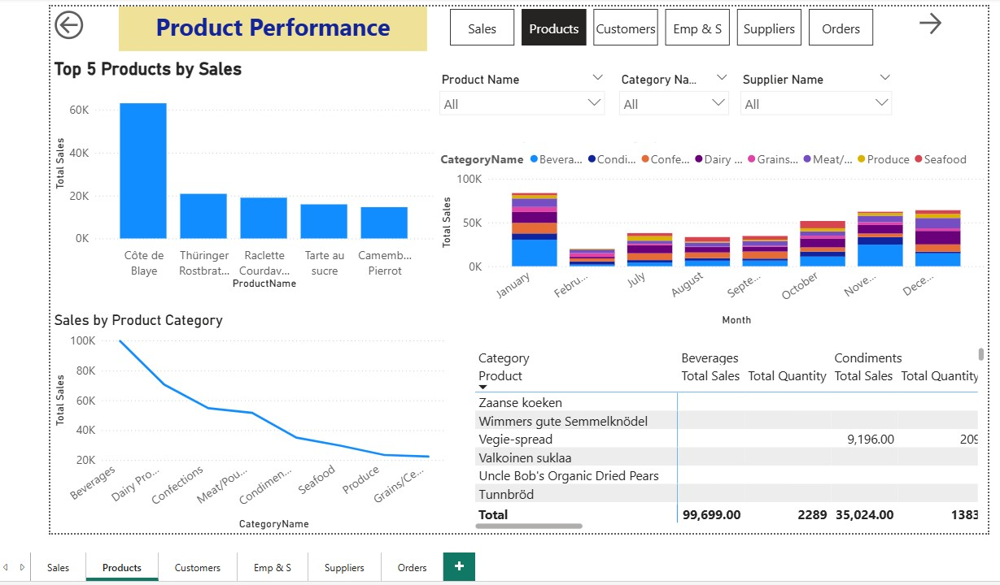

# SQL_Poweer_Bi_Sales_Analysis_Project

## Project Overview
This project demonstrates an **end-to-end Business Intelligence solution** using:
- **SQL Server** for data storage
- **Power BI** for data visualization & reporting

The database contains **Northwind-style** sales data with tables for:
`Categories`, `Customers`, `Employees`, `Shippers`, `Suppliers`, `Products`, `Orders`, and `OrderDetails`.

Power BI dashboards were created by connecting directly to SQL Server and designing interactive, multi-page reports to analyze **Sales, Products, Customers, Employees, Shippers, Suppliers, and Orders**.

---

## Dataset & Database
**Database Name:** `ReyadhStoreDb`  
**Source:** Custom dataset inserted into SQL Server  
**Tables:**
- Categories
- Customers
- Employees
- Shippers
- Suppliers
- Products
- Orders
- OrderDetails

---

## Pages & Dashboards

### **PAGE 1: Sales Overview**
## Goal: High-level summary of business performance
**Visuals**
-  KPI Cards: Total Sales, Total Orders, Total Customers, Average Order Value
-  Line Chart: Sales by Month
-  Map: Sales by Country
-  Bar Chart: Sales by Category

**Slicers:** Date Range, Country, Category

---

### **PAGE 2: Product Performance**
## Goal: Understand which products drive revenue
**Visuals**
-  Bar Chart: Top 5 Products by Sales
-  Matrix: Product Name vs. Category with Sales and Quantity
-  Stacked Column Chart: Sales by Month and Category
-  Line Chart: Sales by Product Category

**Slicers:** Product Name, Category, Supplier

---

### **PAGE 3: Customer Insights**
## Goal: Analyze sales distribution and behavior of customers
**Visuals**
-  Bar Chart: Top 10 Customers by Sales
-  Pie Chart: Sales Share by Country
-  Table: Customer Name, City, Country, Total Orders, Total Sales
-  Scatter Plot: Average Order Value vs. Order Count by Customer

**Slicers:** Country, City, Customer Name

---

### **PAGE 4: Employee & Shipper Performance**
## Goal: Analyze performance of employees and shipping methods
**Visuals**
-  Bar Chart: Sales by Employee
-  Column Chart: Sales by Shipper
-  Column Chart: Order Count by Employees
-  Pie Chart: Sales by Shipper
-  Table: Employee Name, Number of Orders, Total Sales
-  Table: Shipper Name, Order Count, Total Sales

**Slicers:** Employee Name, Shipper Name, Country, Order Date

---

### **PAGE 5: Supplier Analysis**
## Goal: Analyze suppliers' contributions to sales
**Visuals**
-  KPI Cards: Total Suppliers, Supplier Countries, Total Customers, Average Order Value
-  Bar Chart: Sales by Supplier
-  Table: Supplier Name, Product Count, Total Sales, Countries Supplied
-  Stacked Column Chart: Sales by Category and Suppliers

**Slicers:** Supplier, Category, Country, Order Date

---

### **PAGE 6: Order Analysis**
## Goal: Break down orders and identify patterns
**Visuals**
-  KPI Cards: Total Orders, Average Order Value
-  Line Chart: Orders per Month
-  Pie Chart: Order Count by Year
-  Treemap: Order Count by Category
-  Table: Order ID, Order Date, Customer, Category, Product, Sales

**Slicers:** Order Date, Order ID, Customer Name

---

##  How to Use This Project

### 1️. Restore the SQL Server Database
1. Download the provided 'ReyadhStoreDb Database' file from this repository.
2. Open **SQL Server Management Studio (SSMS)**.
3. Restore the database using:

### 2️. Open the Power BI File
1. Download the `.pbix` file from this repository.
2. Open in **Power BI Desktop**.
3. Go to **Transform Data → Data Source Settings** and update the **SQL Server connection** to match your server name.

---

## Screenshots

- **Sales Overview**

- **Product Performance**

- **Customer Insights**

- **Employee & Shipper Analysis**

- **Supplier Analysis**

- **Order Analysis**

---

##  Tech Stack
- **SQL Server** (Database & Queries)
- **Power BI Desktop** (Visualization)
- **DAX** (Calculated measures & KPIs)
- **T-SQL** (Data extraction)

---

## Key Insights from the Dashboard
- Seasonal sales trends identified by month.
- Top-performing product categories and suppliers.
- Customer segmentation by country and spending behavior.
- Employee & shipper performance metrics.

---

## License
This project is open-source and available under the [MIT License](LICENSE).

---

## Contact
**Author:** Rahedul Islam  
**LinkedIn:** https://www.linkedin.com/in/rahedul-islam-246a072aa/    
**Email:** rakibrahedul@gmail.com
